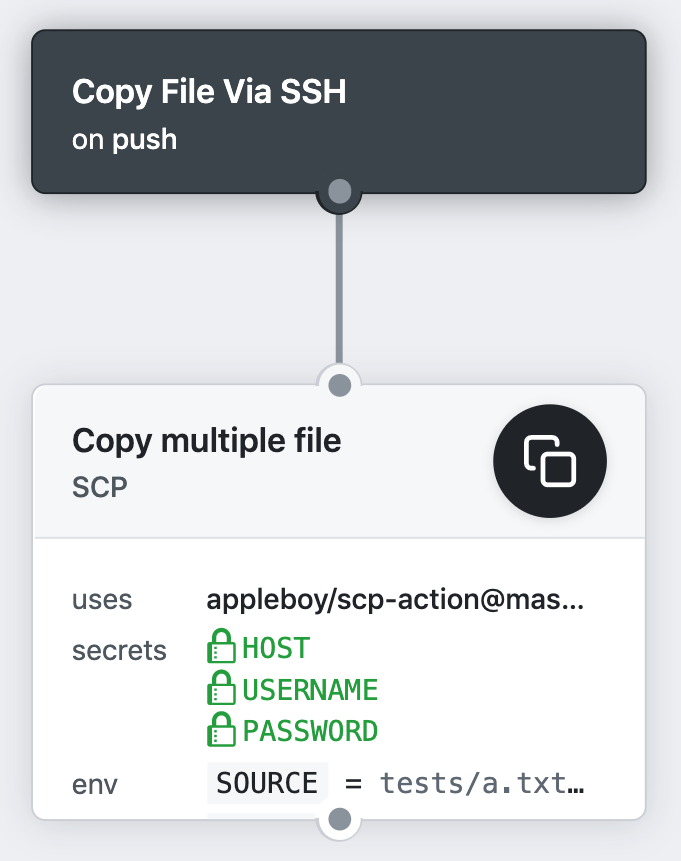

# 🚀 SCP for GitHub Actions

[GitHub Action](https://developer.github.com/actions/) for copying files and artifacts via SSH.



## Usage

copy files and artifacts via SSH as blow.

```yaml
- name: copy file via ssh password
  uses: appleboy/scp-action@master
  with:
    host: ${{ secrets.HOST }}
    username: ${{ secrets.USERNAME }}
    password: ${{ secrets.PASSWORD }}
    port: ${{ secrets.PORT }}
    source: "tests/a.txt,tests/b.txt"
    target: "test"
```

## Input variables

see the [action.yml](./action.yml) file for more detail imformation.

* host - scp remote host
* port - scp remote port
* username - scp username
* password - scp password
* timeout - timeout for ssh to remote host
* command_timeout - timeout for scp command
* key - content of ssh private key. ex raw content of ~/.ssh/id_rsa
* key_path - path of ssh private key
* target - target path on the server
* source - scp file list
* rm - remove target folder before upload data

### Example

Copy file via ssh password

```yaml
- name: copy file via ssh password
  uses: appleboy/scp-action@master
  with:
    host: example.com
    username: foo
    password: bar
    port: 22
    source: "tests/a.txt,tests/b.txt"
    target: "test"
```

Copy file via ssh key

```yaml
- name: copy file via ssh key
  uses: appleboy/scp-action@master
  env:
    HOST: ${{ secrets.HOST }}
    USERNAME: ${{ secrets.USERNAME }}
    PORT: ${{ secrets.PORT }}
    KEY: ${{ secrets.KEY }}
  with:
    source: "tests/a.txt,tests/b.txt"
    target: "test"
```

Example configuration for ignore list:

```yaml
- name: copy file via ssh key
  uses: appleboy/scp-action@master
  env:
    HOST: ${{ secrets.HOST }}
    USERNAME: ${{ secrets.USERNAME }}
    PORT: ${{ secrets.PORT }}
    KEY: ${{ secrets.KEY }}
  with:
    source: "tests/*.txt,!tests/a.txt"
    target: "test"
```

Example configuration for multiple server

```diff
- name: copy file via ssh password
  uses: appleboy/scp-action@master
  with:
-   host: "example.com"
+   host: "foo.com,bar.com"
    username: foo
    password: bar
    port: 22
    source: "tests/a.txt,tests/b.txt"
    target: "test"
```
